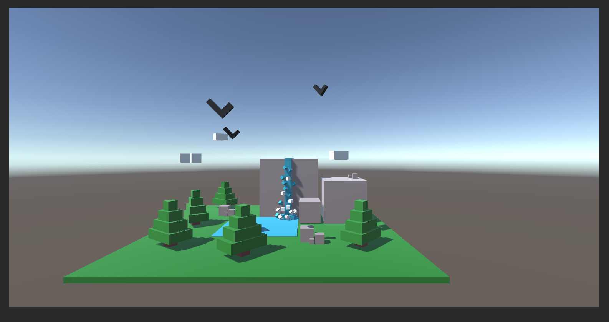
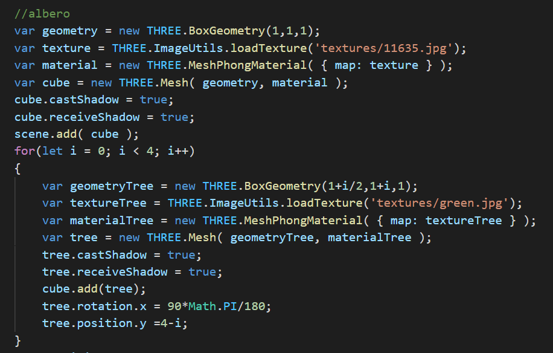
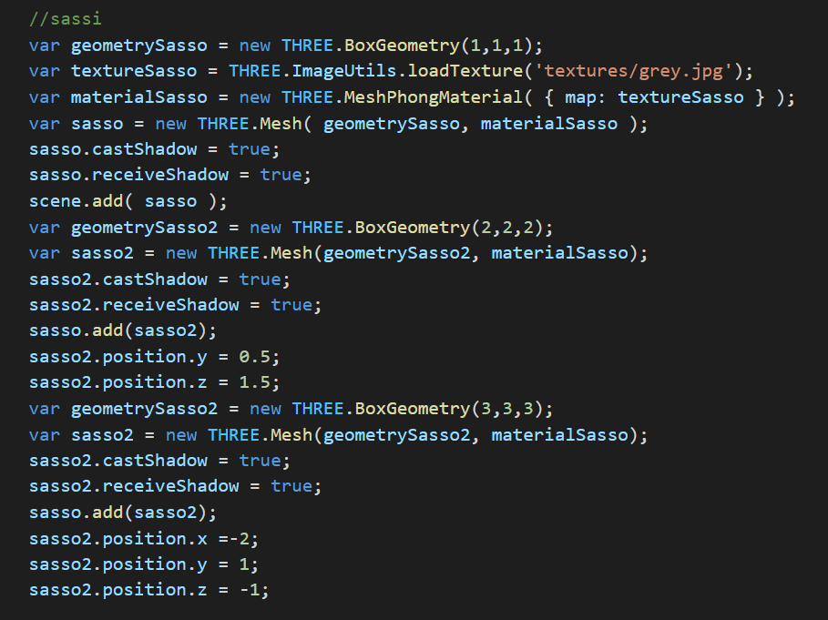
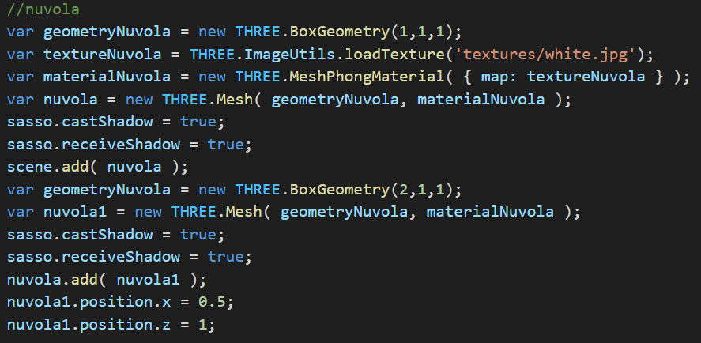
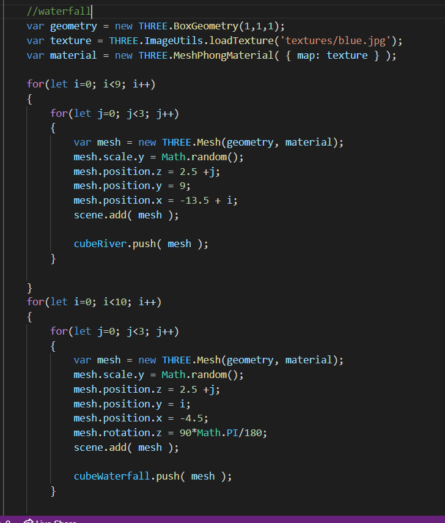

## Journal
# L'idea
Dopo una prima idea di creare qualcosa con cubi colorati che cambiavano colore toccandoli, ho deciso di creare una scena meno interattiva ma più naturale.

L'idea prende spunto dal gioco di Minecraft, dove viene rappresentato il mondo naturale a cubetti. 
Similmente a quello ho deciso di costruire una scena naturale a cubetti.

La prima rappresentazione l'ho realizzata con Unity, così da avere molto chiaro le misure di ogni blocco negli oggetti e il loro posizionamento nella scena. Senza però considerare l'animazione che verrà realizzata e inserita successivamente.

Questa è una foto dell'idea in Unity (senza inserimento delle texture agli oggetti):

# Building
Come prima cosa ho costruito una copia di ogni oggetto che avevo intenzione di inserire, così da essere libera poi di decidere solo il loro posizionamento per la relizzazione della scena.

Iniziando dagli alberi:

I sassi:

Le nuvole:

E alla fine la cascata che, rispetto all'idea iniziale, ho deciso di modificare. La cascata è diventata un insieme di cubetti così da poter essere animata.

